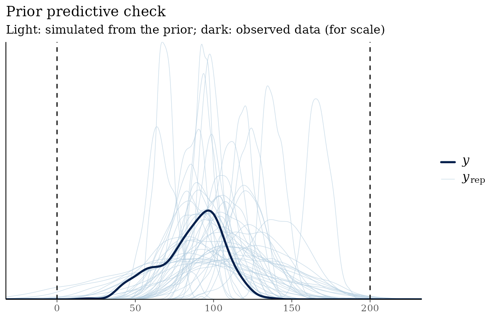
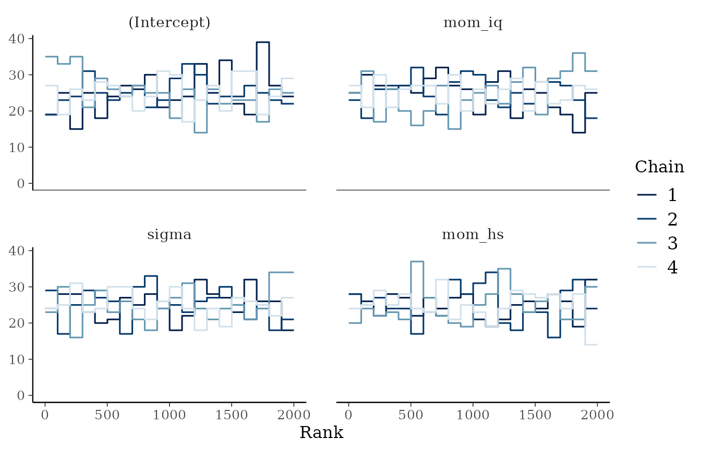
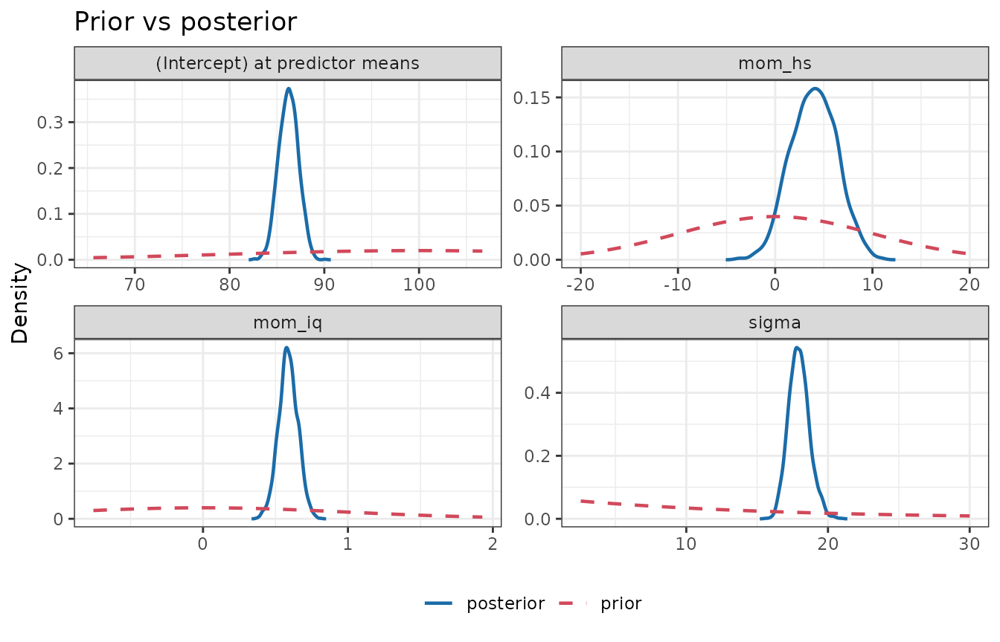

# Get started: a prior-focused Bayesian workflow

bmbeR walks a regression model through the stages of a Bayesian workflow
(Gelman et al., 2020), with the prior treated as a first-class part of
the model rather than an afterthought:

1.  **Specify** priors on a meaningful scale.
2.  **Check** what they imply *before* seeing the outcome (prior
    predictive check).
3.  **Fit** the model and **verify** the computation (modern MCMC
    diagnostics).
4.  **Quantify** how much the prior influenced the result (power-scaling
    sensitivity).
5.  **Evaluate** predictions with proper scoring rules.
6.  **Report** everything in a checklist aligned with the Bayesian
    Analysis Reporting Guidelines (Kruschke, 2021).

Models are fitted with [rstanarm](https://mc-stan.org/rstanarm/), so
every result is an ordinary `stanreg` object that works with the rest of
the Stan ecosystem.

``` r

library(bmbeR)
data(kidiq, package = "rstanarm")
head(kidiq)
#>   kid_score mom_hs    mom_iq mom_age
#> 1        65      1 121.11753      27
#> 2        98      1  89.36188      25
#> 3        85      1 115.44316      27
#> 4        83      1  99.44964      25
#> 5       115      1  92.74571      27
#> 6        98      0 107.90184      18
```

The `kidiq` data (Gelman & Hill, 2007) record the test scores of 434
children together with their mothers’ IQ and whether the mother finished
high school. We hold out a test set to evaluate predictions at the end.

``` r

set.seed(42)
test_rows <- sample(nrow(kidiq), 100)
train <- kidiq[-test_rows, ]
test  <- kidiq[test_rows, ]
```

## 1. Specify priors

Priors only make sense relative to the units of the data. Children’s
test scores are on an IQ-like scale (mean about 100, SD about 15), so:

- the **intercept** is the expected score of a child whose mother has
  average IQ and schooling (rstanarm puts the intercept prior at the
  predictor means, so you don’t have to centre the predictors yourself):
  `normal(100, 20)`;
- a one-point increase in the mother’s IQ is unlikely to change the
  child’s score by more than about two points: `normal(0, 1)` for
  `mom_iq`;
- finishing high school might plausibly shift scores by up to about 20
  points: `normal(0, 10)` for `mom_hs`;
- the residual SD is probably of the order of 15 points:
  `exponential(1/15)`.

``` r

priors <- prior_config(
  intercept = prior_spec("normal", location = 100, scale = 20),
  slope     = prior_spec("normal", location = 0, scale = c(1, 10)),
  aux       = prior_spec("exponential", rate = 1 / 15)
)
priors
#> <bmb_prior_config>
#>   intercept : normal(location = 100, scale = 20)
#>   slope     : normal(location = 0, scale = [1, 10])
#>   aux       : exponential(rate = 0.0667)
```

If you have no substantive knowledge to encode, leave components as
`NULL` to use rstanarm’s autoscaled weakly informative defaults, or
derive priors from data with
[`empirical_bayes_priors()`](https://elkronos.github.io/bmbeR/reference/empirical_bayes_priors.md)
(see the article on *Data-informed priors*).

## 2. Check the priors before fitting

A prior predictive check simulates data from the priors alone. Test
scores cannot be negative, and scores above 200 would be absurd, so we
declare that range as plausible:

``` r

pc <- prior_predictive_check(train, kid_score ~ mom_iq + mom_hs,
                             prior_config = priors,
                             plausible_range = c(0, 200), refresh = 0)
pc
#> <bmb_prior_check> 200 simulated data sets of 334 observations (gaussian family)
#>   Observed outcome range     : [20, 136]
#>   Prior predictive quantiles : 1%: 16.89 | 5%: 48.73 | 50%: 99.92 | 95%: 152.9 | 99%: 180
#>   Mean of simulated data (5%, 50%, 95%): 67.75, 100.1, 132.1
#>   Share of simulated values outside plausible range [0, 200]: 0.9%
plot(pc)
```



The simulated data sets are wider than the observed data, as they should
be (the priors are weakly informative), but almost all simulated values
stay within the plausible range.

## 3. Fit the model and verify the computation

``` r

fit <- fit_model_with_prior(train, kid_score ~ mom_iq + mom_hs,
                            prior_config = priors,
                            chains = 4, iter = 1000, refresh = 0)
attr(fit, "bmb_convergence")
#> <bmb_convergence> PASSED  (4 chains, 2000 post-warm-up draws)
#>   Criteria: R-hat <= 1.01; bulk/tail-ESS >= 400; divergences <= 0; E-BFMI >= 0.3
#>   Max R-hat: 1.003 | min bulk-ESS: 2237 | min tail-ESS: 1271
#>   Divergences: 0 | max-treedepth hits: 0 | min E-BFMI: 0.98
```

[`fit_model_with_prior()`](https://elkronos.github.io/bmbeR/reference/fit_model_with_prior.md)
runs
[`check_convergence()`](https://elkronos.github.io/bmbeR/reference/check_convergence.md)
automatically using the criteria of Vehtari et al. (2021):
rank-normalised R-hat below 1.01, bulk- and tail-ESS of at least 100 per
chain, no divergent transitions and adequate E-BFMI. If a check fails it
warns and still returns the fit so you can investigate; rank plots are
the most sensitive visual check:

``` r

plot(attr(fit, "bmb_convergence"), type = "rank")
```



## 4. How much did the prior matter?

[`plot_prior_posterior()`](https://elkronos.github.io/bmbeR/reference/plot_prior_posterior.md)
overlays each prior on its posterior:

``` r

plot_prior_posterior(fit)
```



[`prior_sensitivity()`](https://elkronos.github.io/bmbeR/reference/prior_sensitivity.md)
quantifies the same question without refitting, by power-scaling the
prior and the likelihood (Kallioinen et al., 2023):

``` r

sens <- prior_sensitivity(fit)
sens
#> <bmb_prior_sensitivity> power-scaling diagnostics (2000 draws, threshold 0.05)
#>     variable   mean    sd contraction prior_mean_sens prior_sd_sens
#>  (Intercept) 86.223 1.028       0.997           0.040        -0.007
#>       mom_iq  0.588 0.066       0.996          -0.016        -0.005
#>       mom_hs  3.975 2.344       0.945          -0.087        -0.025
#>        sigma 17.954 0.731       0.998          -0.057        -0.008
#>  lik_mean_sens lik_sd_sens conflict_z         diagnosis
#>          0.009      -0.534      0.333                 -
#>          0.008      -0.458     -0.176                 -
#>          0.101      -0.393     -0.439 informative prior
#>         -0.279      -0.588     -0.407 informative prior
#> 
#> Flagged parameters:
#>   mom_hs               informative prior
#>   sigma                informative prior
#> 
#> Finite perturbations: posterior mean shift, in posterior SDs, when the prior or
#> likelihood is raised to the power alpha (* = unreliable importance sampling;
#> refit with sensitivity_analysis() instead):
#>             prior a=0.8 prior a=1.25 lik a=0.8 lik a=1.25
#> (Intercept) -0.01       +0.01        -0.00     +0.00     
#> mom_iq      +0.00       -0.00        +0.01     +0.00     
#> mom_hs      +0.02       -0.02        -0.03     +0.02     
#> sigma       +0.01       -0.01        +0.08     -0.05     
#> Intercept diagnostics refer to the intercept at the predictor means.
```

How to read the table:

- `contraction` near 1 means the data have sharpened the prior a lot.
- The `*_sens` columns measure how much the posterior mean and SD
  respond to strengthening the prior or the likelihood (0 = not at all).
- `conflict_z` measures disagreement between prior and data in
  standard-error units; values beyond ±2 indicate a prior-data conflict.

The diagnosis flags `mom_hs` and `sigma`: for these parameters the prior
contributes a non-negligible share of the posterior precision. Because
every \|conflict_z\| is well below 2, prior and data agree, which is
what an informative-but-sensible prior should look like. The remaining
parameters are dominated by the likelihood. The *Prior sensitivity*
article shows what weakly informative, conflicting and weakly identified
cases look like.

## 5. Evaluate predictions

``` r

perf <- evaluate_model_performance(fit, test)
perf
#> <bmb_performance> regression, 100 test observations
#>   ELPD (log score, higher = better)        -436
#>     SE of ELPD                             6.01
#>     ELPD per observation                   -4.36
#>   RMSE of posterior mean                   18.9
#>   MAE of posterior mean                    15.8
#>   CRPS (lower = better)                    10.9
#>   Coverage of 90% predictive intervals     0.88
#>   Mean interval width                      59.1
```

Besides RMSE and MAE of the posterior mean, bmbeR reports proper scoring
rules that also reward honest uncertainty: the held-out log predictive
density (ELPD) and the continuous ranked probability score (CRPS).
Coverage of the 90% predictive intervals close to 90% indicates
well-calibrated uncertainty.

## 6. Report

``` r

report <- workflow_report(fit, prior_check = pc, sensitivity = sens,
                          performance = perf)
report
#> Bayesian analysis report (BARG checklist; Kruschke, 2021)
#> ============================================================
#> [ok]    1. Model
#>           kid_score ~ mom_iq + mom_hs; gaussian family, identity link; 334
#>           observations; 3 coefficients
#> [ok]    2. Priors
#>           user-specified: (Intercept) ~ normal(100, 20); mom_iq ~ normal(0,
#>           1); mom_hs ~ normal(0, 10); sigma ~ exponential(rate = 0.0667)
#> [ok]    3. Prior predictive check
#>           90% of prior predictive values in [48.7, 153]; observed range
#>           [20, 136]
#> [ok]    4. MCMC computation
#>           4 chains x 1000 iterations (500 warm-up), seed 1234. Max R-hat
#>           1.003, min bulk-ESS 2237, min tail-ESS 1271, 0 divergences.
#> [ok]    5. Posterior summary
#>           Means, medians, SDs and 95% central credible intervals for 4
#>           parameters (see $posterior).
#> [ok]    6. Posterior predictive check
#>           Posterior predictive p-values: mean 0.49, sd 0.52, min 0.86, max
#>           0.91
#> [ok]    7. Cross-validation (PSIS-LOO)
#>           elpd_loo = -1440.4 (SE 13.3), p_loo = 4.1; 0 observation(s) with
#>           Pareto k > 0.70
#> [ok]    8. Prior sensitivity
#>           Power-scaling: mom_hs (informative prior); sigma (informative
#>           prior)
#> [ok]    9. Held-out predictive performance
#>           ELPD = -436, RMSE = 18.9, CRPS = 10.9, Coverage = 0.88
#> [ok]    10. Software
#>           R 4.6.1; rstanarm 2.32.2; rstan 2.32.7; bmbeR 2.0.0
#> 
#> Posterior summary:
#>     variable   mean median     sd   q2.5  q97.5 p_positive
#>  (Intercept) 24.400 24.400 6.5000 11.800 36.900       1.00
#>       mom_iq  0.588  0.586 0.0659  0.456  0.716       1.00
#>       mom_hs  3.970  4.000 2.3400 -0.524  8.500       0.96
#>        sigma 18.000 17.900 0.7310 16.600 19.500       1.00
#> 
#> 0 item(s) need attention, 0 not yet done.
```

Items marked `[check]` need attention and `[ -- ]` items have not been
done yet. The report adds posterior predictive p-values and PSIS-LOO
cross-validation, which are cheap to compute from the fit.

## Where next

- *Choosing priors*: why scale matters, autoscaling, and prior
  predictive checks for logistic regression.
- *Data-informed priors*: unit-information, empirical Bayes and power
  priors, and why naively re-using the data is a mistake.
- *Convergence diagnostics*: what each criterion means and what failure
  looks like.
- *Prior sensitivity*: the theory behind the diagnostics, and refitting
  under alternative priors.
- *Predictive evaluation*: proper scoring rules and model comparison on
  held-out data.

## References

Gelman, A., & Hill, J. (2007). *Data Analysis Using Regression and
Multilevel/Hierarchical Models*. Cambridge University Press.

Gelman, A., Vehtari, A., Simpson, D., et al. (2020). Bayesian workflow.
*arXiv:2011.01808*.

Kallioinen, N., Paananen, T., Bürkner, P.-C., & Vehtari, A. (2023).
Detecting and diagnosing prior and likelihood sensitivity with
power-scaling. *Statistics and Computing*, 34, 57.

Kruschke, J. K. (2021). Bayesian analysis reporting guidelines. *Nature
Human Behaviour*, 5, 1282–1291.

Vehtari, A., Gelman, A., Simpson, D., Carpenter, B., & Bürkner, P.-C.
(2021). Rank-normalization, folding, and localization: An improved R-hat
for assessing convergence of MCMC. *Bayesian Analysis*, 16(2), 667–718.
