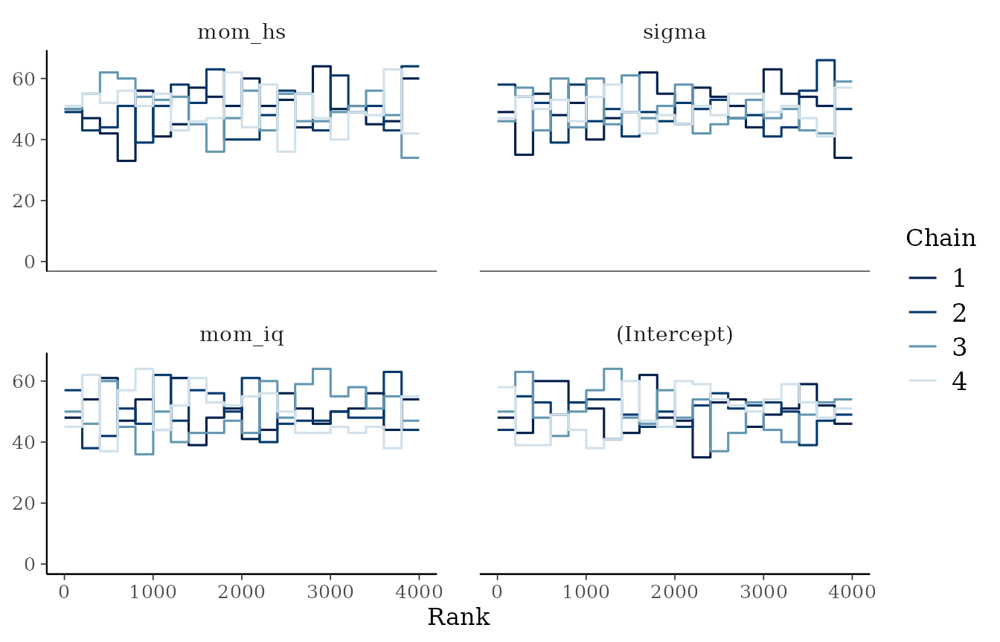
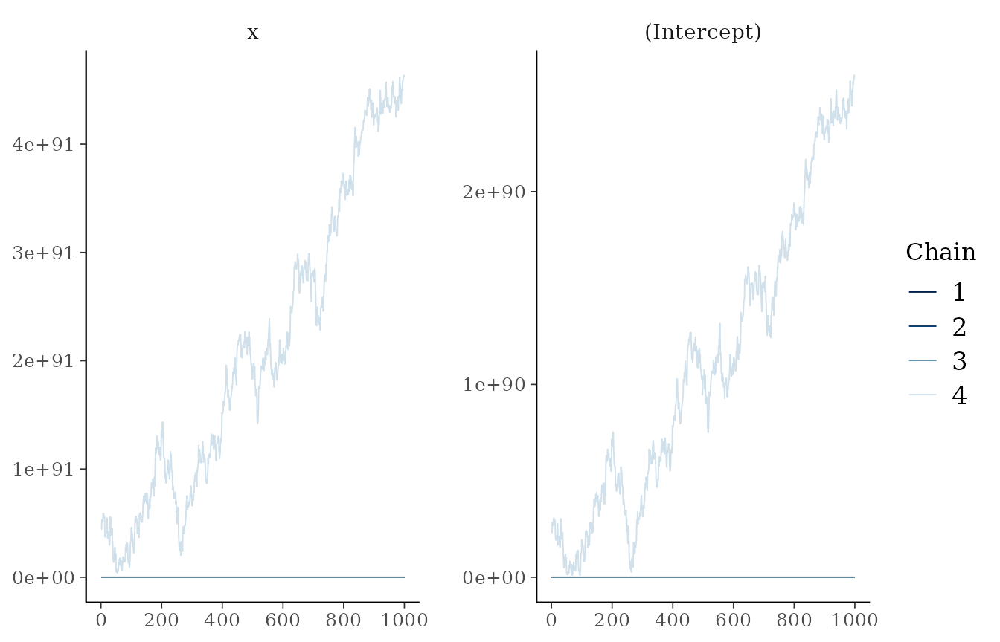

# Convergence diagnostics: what they mean and what failure looks like

``` r

library(bmbeR)
```

MCMC produces draws that are only guaranteed to represent the posterior
in the limit. Convergence diagnostics check whether *these* draws are
good enough.
[`check_convergence()`](https://elkronos.github.io/bmbeR/reference/check_convergence.md)
applies the current recommendations of the Stan developers and Vehtari
et al. (2021).

| Diagnostic | Default threshold | What failure means |
|----|----|----|
| Rank-normalised split-R-hat | ≤ 1.01 | Chains disagree with each other (or drift within themselves): they have not explored the same distribution. |
| Bulk-ESS | ≥ 100 × chains | Too few effectively independent draws to estimate means and medians reliably. |
| Tail-ESS | ≥ 100 × chains | Too few to estimate 5% and 95% quantiles, i.e. interval endpoints. |
| Divergent transitions | 0 | The sampler hit regions of high curvature it cannot explore; results may be biased (Betancourt, 2017). |
| E-BFMI | ≥ 0.3 per chain | The momentum resampling explores the energy distribution poorly (often heavy tails). |
| Max tree depth hits | reported only | An efficiency issue: the sampler needed very long trajectories. |

Two changes from older practice matter. The traditional R-hat threshold
of 1.1 misses many failures that 1.01 catches, and the rank-normalised
version also detects chains that differ in scale or have heavy tails.
Tail-ESS was introduced because a good bulk-ESS can hide unreliable
interval endpoints.

## A healthy fit

``` r

data(kidiq, package = "rstanarm")
fit <- fit_model_with_prior(kidiq, kid_score ~ mom_iq + mom_hs, refresh = 0)
conv <- attr(fit, "bmb_convergence")
conv
#> <bmb_convergence> PASSED  (4 chains, 4000 post-warm-up draws)
#>   Criteria: R-hat <= 1.01; bulk/tail-ESS >= 400; divergences <= 0; E-BFMI >= 0.3
#>   Max R-hat: 1.001 | min bulk-ESS: 3526 | min tail-ESS: 2714
#>   Divergences: 0 | max-treedepth hits: 0 | min E-BFMI: 0.97
head(conv$parameters)
#>      variable     rhat ess_bulk ess_tail rhat_ok ess_ok
#> 1 (Intercept) 1.000171 3789.075 3028.347    TRUE   TRUE
#> 2      mom_iq 1.000685 3526.321 2714.090    TRUE   TRUE
#> 3      mom_hs 1.001279 4034.719 3033.999    TRUE   TRUE
#> 4       sigma 1.001098 4330.712 2902.613    TRUE   TRUE
```

Rank plots show, for each chain, a histogram of the ranks of its draws
among all chains. If the chains are sampling the same distribution,
every histogram is approximately uniform:

``` r

plot(conv, type = "rank")
```



## When computation fails: often a modelling problem

The “folk theorem of statistical computing” (Gelman, 2008) says that
when you have computational problems, there is often a problem with your
model. A logistic regression on *separable* data, where a predictor
perfectly predicts the outcome, has no finite maximum-likelihood
estimate. With a flat prior the posterior is improper, and no sampler
can succeed:

``` r

set.seed(3)
sep <- data.frame(x = c(rnorm(20, -1), rnorm(20, 1)))
sep$y <- as.integer(sep$x > 0)  # x perfectly separates the classes

flat <- prior_config(intercept = prior_spec("flat"), slope = prior_spec("flat"))
fit_flat <- fit_model_with_prior(sep, y ~ x, family = binomial(),
                                 prior_config = flat, refresh = 0)
#> Warning: There were 42 divergent transitions after warmup. See
#> https://mc-stan.org/misc/warnings.html#divergent-transitions-after-warmup
#> to find out why this is a problem and how to eliminate them.
#> Warning: There were 3958 transitions after warmup that exceeded the maximum treedepth. Increase max_treedepth above 15. See
#> https://mc-stan.org/misc/warnings.html#maximum-treedepth-exceeded
#> Warning: Examine the pairs() plot to diagnose sampling problems
#> Warning: The largest R-hat is NA, indicating chains have not mixed.
#> Running the chains for more iterations may help. See
#> https://mc-stan.org/misc/warnings.html#r-hat
#> Warning: Bulk Effective Samples Size (ESS) is too low, indicating posterior means and medians may be unreliable.
#> Running the chains for more iterations may help. See
#> https://mc-stan.org/misc/warnings.html#bulk-ess
#> Warning: Tail Effective Samples Size (ESS) is too low, indicating posterior variances and tail quantiles may be unreliable.
#> Running the chains for more iterations may help. See
#> https://mc-stan.org/misc/warnings.html#tail-ess
#> Warning: Markov chains did not converge! Do not analyze results!
#> Warning: MCMC convergence checks failed:
#>   - R-hat > 1.01 for 2 parameter(s): (Intercept), x (max 4.297).
#>   - Bulk- or tail-ESS < 400 for 2 parameter(s): (Intercept), x (min bulk 4, min tail 11).
#>   - 42 divergent transition(s) after warm-up. Increase adapt_delta or reparameterise; do not ignore divergences.
#> Inspect attr(fit, "bmb_convergence"). Do not interpret the results until resolved.
attr(fit_flat, "bmb_convergence")
#> <bmb_convergence> FAILED  (4 chains, 4000 post-warm-up draws)
#>   Criteria: R-hat <= 1.01; bulk/tail-ESS >= 400; divergences <= 0; E-BFMI >= 0.3
#>   Max R-hat: 4.297 | min bulk-ESS: 4 | min tail-ESS: 11
#>   Divergences: 42 | max-treedepth hits: 3958 | min E-BFMI: 1.93
#>   Issues:
#>    - R-hat > 1.01 for 2 parameter(s): (Intercept), x (max 4.297). 
#>    - Bulk- or tail-ESS < 400 for 2 parameter(s): (Intercept), x (min bulk 4, min tail 11). 
#>    - 42 divergent transition(s) after warm-up. Increase adapt_delta or reparameterise; do not ignore divergences. 
#>   Inspect with plot(<this object>) and see https://mc-stan.org/misc/warnings.html
#>   Notes:
#>    - 3958 iteration(s) hit the maximum tree depth (15): an efficiency concern, not a validity one.
```

R-hat, both ESS measures and the divergence check all fail, and almost
every iteration saturates the maximum tree depth as the sampler takes
ever longer trajectories. The trace plots show chains wandering off
towards infinity, each in its own direction:

``` r

plot(attr(fit_flat, "bmb_convergence"), type = "trace")
```



Notice that
[`fit_model_with_prior()`](https://elkronos.github.io/bmbeR/reference/fit_model_with_prior.md)
warned but still returned the fit, so it can be inspected. Pass
`on_nonconvergence = "error"` to stop instead.

A weakly informative prior makes the posterior proper and the
computation easy. It also encodes something we genuinely believe:
coefficients of a logistic regression are not infinite.

``` r

fit_wi <- fit_model_with_prior(sep, y ~ x, family = binomial(), refresh = 0)
attr(fit_wi, "bmb_convergence")
#> <bmb_convergence> PASSED  (4 chains, 4000 post-warm-up draws)
#>   Criteria: R-hat <= 1.01; bulk/tail-ESS >= 400; divergences <= 0; E-BFMI >= 0.3
#>   Max R-hat: 1.004 | min bulk-ESS: 1811 | min tail-ESS: 1672
#>   Divergences: 0 | max-treedepth hits: 0 | min E-BFMI: 0.83
```

## Too few iterations

Even for a well-behaved model, too few iterations give unreliable
estimates. With 60 iterations per chain, warm-up is too short for
adaptation:

``` r

fit_short <- suppressWarnings(
  fit_model_with_prior(kidiq, kid_score ~ mom_iq + mom_hs, iter = 60,
                       refresh = 0, on_nonconvergence = "ignore")
)
attr(fit_short, "bmb_convergence")
#> <bmb_convergence> FAILED  (4 chains, 120 post-warm-up draws)
#>   Criteria: R-hat <= 1.01; bulk/tail-ESS >= 400; divergences <= 0; E-BFMI >= 0.3
#>   Max R-hat: 3.086 | min bulk-ESS: 7 | min tail-ESS: 22
#>   Divergences: 0 | max-treedepth hits: 0 | min E-BFMI: 0.09
#>   Issues:
#>    - R-hat > 1.01 for 4 parameter(s): (Intercept), mom_iq, mom_hs, sigma (max 3.086). 
#>    - Bulk- or tail-ESS < 400 for 4 parameter(s): (Intercept), mom_iq, mom_hs, sigma (min bulk 7, min tail 22). 
#>    - E-BFMI < 0.3 in chain(s) 1, 2. 
#>   Inspect with plot(<this object>) and see https://mc-stan.org/misc/warnings.html
```

The remedy is simply to run longer chains (the default `iter = 2000` is
ample for most regression models).

## Using the diagnostics in code

``` r

conv <- check_convergence(fit, rhat_threshold = 1.01, min_ess = 400)
if (!isTRUE(conv$converged)) stop("Fix the computation before interpreting results.")
```

[`check_convergence()`](https://elkronos.github.io/bmbeR/reference/check_convergence.md)
accepts both rstanarm (`stanreg`) and rstan (`stanfit`) objects.
`save_plots = TRUE` writes rank and trace plots to a PDF.
[`generate_plot()`](https://elkronos.github.io/bmbeR/reference/generate_plot.md)
produces further diagnostic plots (histograms, densities,
autocorrelation) as a list of ggplot objects.

## References

Betancourt, M. (2017). A conceptual introduction to Hamiltonian Monte
Carlo. *arXiv:1701.02434*.

Gelman, A. (2008). The folk theorem of statistical computing.
*Statistical Modeling, Causal Inference, and Social Science* (blog), 13
May 2008.

Vehtari, A., Gelman, A., Simpson, D., Carpenter, B., & Bürkner, P.-C.
(2021). Rank-normalization, folding, and localization: An improved R-hat
for assessing convergence of MCMC. *Bayesian Analysis*, 16(2), 667–718.
