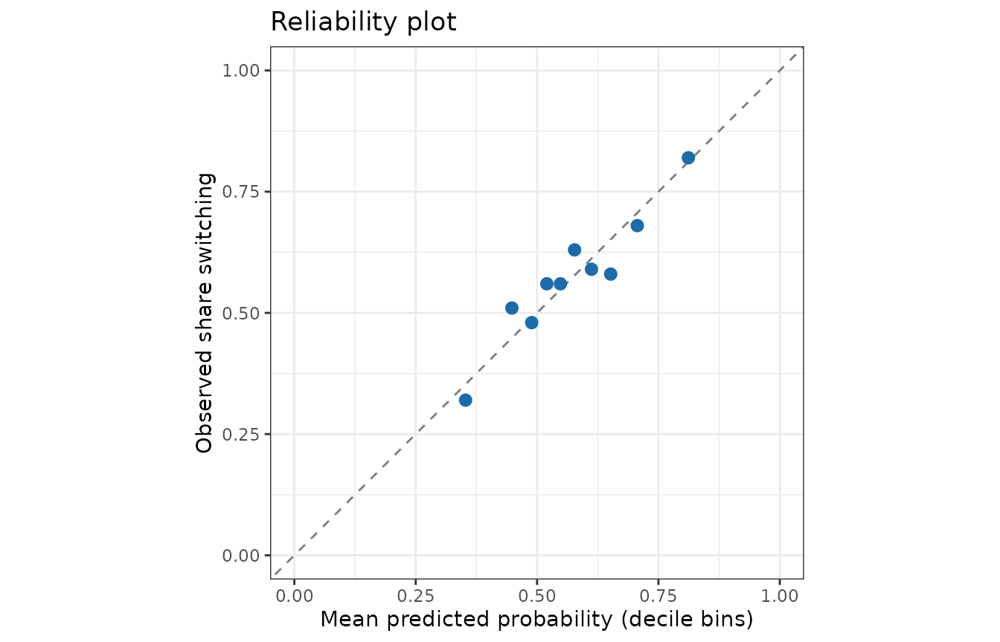

# Predictive evaluation with proper scoring rules

``` r

library(bmbeR)
library(ggplot2)
```

A Bayesian model predicts a *distribution*, not a number. Scoring only
the posterior mean (RMSE, accuracy) ignores whether the model’s
uncertainty is honest. **Proper scoring rules** reward a forecast for
being both accurate and calibrated: they are optimised in expectation
only by reporting your true predictive distribution (Gneiting & Raftery,
2007).
[`evaluate_model_performance()`](https://elkronos.github.io/bmbeR/reference/evaluate_model_performance.md)
reports:

| Metric | Outcome | Better | Notes |
|----|----|----|----|
| `ELPD` | all | higher | log predictive density on the test set; the out-of-sample analogue of `elpd_loo` |
| `CRPS` | continuous / count | lower | in the units of the outcome; reduces to absolute error for a point forecast |
| `Brier` | binary | lower | mean squared error of predicted probabilities |
| `Coverage` | continuous / count | ≈ `prob` | calibration of the predictive intervals |
| `AUC` | binary | higher | discrimination only (not a proper score) |
| `RMSE`, `MAE`, `Accuracy`, `Precision`, `Recall`, `F1_Score` |  |  | familiar point-prediction metrics |

## Binary outcomes: the wells data

``` r

data(wells, package = "rstanarm")
wells$dist100 <- wells$dist / 100
set.seed(123)
test_rows <- sample(nrow(wells), 1000)
train <- wells[-test_rows, ]
test  <- wells[test_rows, ]

fit_dist <- fit_model_with_prior(train, switch ~ dist100, family = binomial(),
                                 refresh = 0)
fit_full <- fit_model_with_prior(train, switch ~ dist100 + arsenic + educ,
                                 family = binomial(), refresh = 0)
perf_dist <- evaluate_model_performance(fit_dist, test)
perf_full <- evaluate_model_performance(fit_full, test)
perf_full
#> <bmb_performance> classification, 1000 test observations
#>   ELPD (log score, higher = better)        -652
#>     SE of ELPD                             9.14
#>     ELPD per observation                   -0.652
#>   Accuracy (threshold 0.5)                 0.611
#>   Precision                                0.629
#>   Recall                                   0.784
#>   F1 score                                 0.698
#>   Brier score (lower = better)             0.23
#>   AUC                                      0.635
```

Classification metrics are computed from the posterior mean
*probability* of switching, thresholded at 0.5 (see `threshold`).
Accuracy alone can hide a lot: the Brier score and ELPD also penalise
overconfident probabilities.

### Comparing models on the same test set

Because both models are scored on the same households, the difference in
ELPD should be assessed with the standard error of the *paired*
(per-observation) differences, not by comparing the two ELPDs and their
separate standard errors:

``` r

compare_performance(distance_only = perf_dist, full = perf_full)
#>           model      elpd elpd_diff  se_diff
#> 1          full -652.0737   0.00000 0.000000
#> 2 distance_only -678.7845 -26.71073 6.950787
```

A difference of several standard errors is a clear improvement.

### Calibration

For a calibrated model, among households given a predicted probability
of about 0.7, about 70% should switch. A reliability plot checks this:

``` r

p <- colMeans(rstanarm::posterior_epred(fit_full, newdata = test))
bins <- cut(p, breaks = quantile(p, 0:10 / 10), include.lowest = TRUE)
calib <- data.frame(predicted = tapply(p, bins, mean),
                    observed  = tapply(test$switch, bins, mean))
ggplot(calib, aes(predicted, observed)) +
  geom_abline(linetype = "dashed", colour = "grey50") +
  geom_point(size = 2.5, colour = "#1b6ca8") +
  coord_equal(xlim = c(0, 1), ylim = c(0, 1)) +
  labs(x = "Mean predicted probability (decile bins)", y = "Observed share switching",
       title = "Reliability plot") +
  theme_bw()
```



## Continuous outcomes

For continuous outcomes the CRPS and interval coverage complement RMSE:

``` r

data(kidiq, package = "rstanarm")
set.seed(1)
test_rows <- sample(nrow(kidiq), 100)
fit_kid <- fit_model_with_prior(kidiq[-test_rows, ], kid_score ~ mom_iq * mom_hs,
                                refresh = 0)
evaluate_model_performance(fit_kid, kidiq[test_rows, ], prob = 0.9)
#> <bmb_performance> regression, 100 test observations
#>   ELPD (log score, higher = better)        -436
#>     SE of ELPD                             6.98
#>     ELPD per observation                   -4.36
#>   RMSE of posterior mean                   18.9
#>   MAE of posterior mean                    15.4
#>   CRPS (lower = better)                    10.8
#>   Coverage of 90% predictive intervals     0.9
#>   Mean interval width                      58.8
```

Coverage close to the nominal 90% means the predictive intervals are
about the right width; much lower coverage signals overconfidence.

## Held-out data or LOO?

When no test set is available, PSIS-LOO cross-validation (Vehtari et
al., 2017) estimates the same ELPD from the training data alone:

``` r

loo::loo(fit_full)
#> 
#> Computed from 4000 by 2020 log-likelihood matrix.
#> 
#>          Estimate   SE
#> elpd_loo  -1307.6 13.5
#> p_loo         4.2  0.2
#> looic      2615.2 27.0
#> ------
#> MCSE of elpd_loo is 0.0.
#> MCSE and ESS estimates assume independent draws (r_eff=1).
#> 
#> All Pareto k estimates are good (k < 0.7).
#> See help('pareto-k-diagnostic') for details.
```

[`workflow_report()`](https://elkronos.github.io/bmbeR/reference/workflow_report.md)
reports LOO automatically and includes held-out metrics when you pass
them via `performance =`.

## References

Brier, G. W. (1950). Verification of forecasts expressed in terms of
probability. *Monthly Weather Review*, 78(1), 1–3.

Gneiting, T., & Raftery, A. E. (2007). Strictly proper scoring rules,
prediction, and estimation. *JASA*, 102(477), 359–378.

Vehtari, A., Gelman, A., & Gabry, J. (2017). Practical Bayesian model
evaluation using leave-one-out cross-validation and WAIC. *Statistics
and Computing*, 27(5), 1413–1432.
