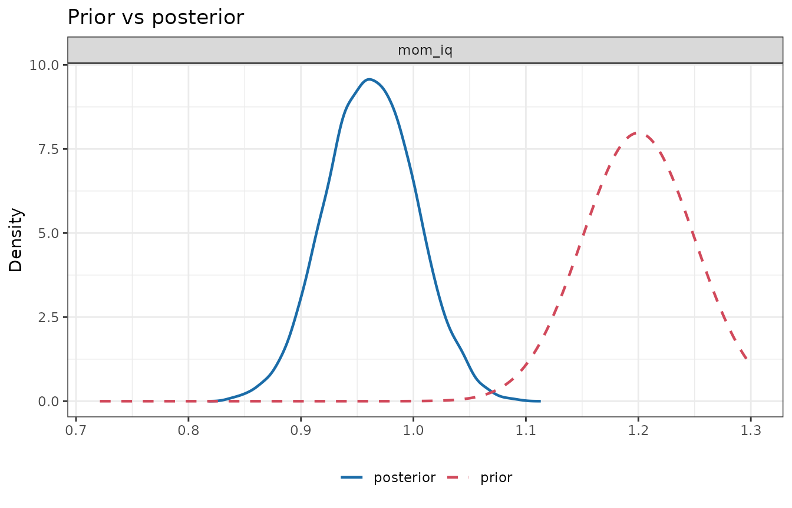
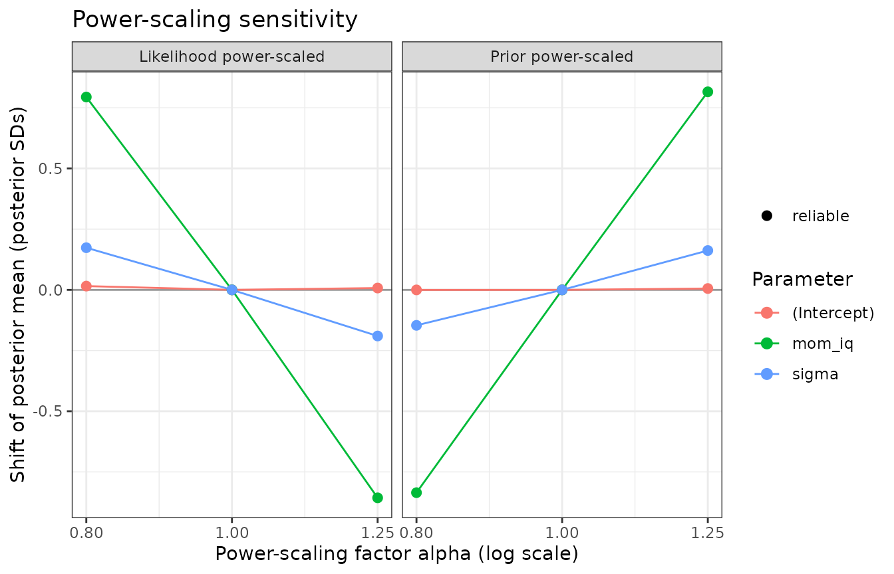
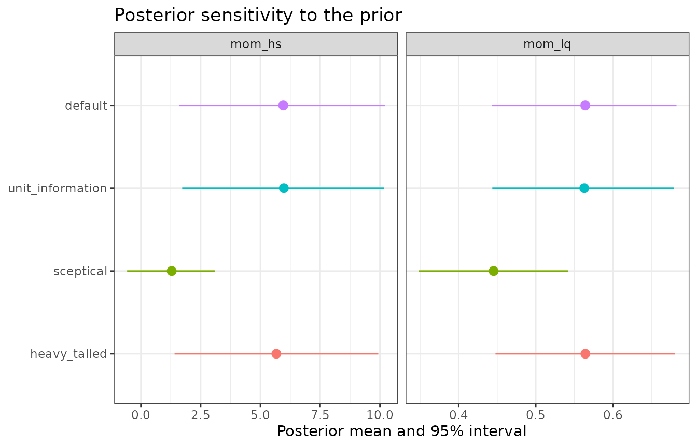

# Prior sensitivity: power-scaling diagnostics and refitting

``` r

library(bmbeR)
data(kidiq, package = "rstanarm")
```

Every Bayesian analysis should ask *how much did the prior matter?*
bmbeR offers two complementary answers:

- [`prior_sensitivity()`](https://elkronos.github.io/bmbeR/reference/prior_sensitivity.md):
  **local** diagnostics computed from a single fit, with no refitting,
  by power-scaling the prior and the likelihood (Kallioinen et al.,
  2023).
- [`sensitivity_analysis()`](https://elkronos.github.io/bmbeR/reference/sensitivity_analysis.md):
  a **global** check that refits the model under alternative priors and
  compares posteriors and predictive performance.

## Power-scaling

Power-scaling raises the prior (or the likelihood) to a power
$`\alpha`$:

``` math
p_\alpha(\theta \mid y) \propto p(\theta)^\alpha \, p(y \mid \theta).
```

$`\alpha > 1`$ strengthens the prior, $`\alpha < 1`$ weakens it. If the
posterior barely changes as $`\alpha`$ moves away from 1, the prior is
not driving the results.

### Local sensitivity is a posterior covariance

Differentiating a posterior expectation with respect to $`\log\alpha`$
at $`\alpha = 1`$ gives a posterior covariance (Giordano et al., 2018):

``` math
\left.\frac{d\,E_\alpha[f(\theta)]}{d\log\alpha}\right|_{\alpha=1}
= \mathrm{Cov}\big(f(\theta),\, \log p(\theta)\big).
```

So the sensitivities can be computed exactly (up to Monte Carlo error)
from the posterior draws you already have. bmbeR reports, for each
parameter:

- `prior_mean_sens` $`= \mathrm{Cov}(\theta, \log p(\theta))/\sigma`$:
  the change in the posterior mean, in posterior SDs, per unit of
  $`\log\alpha`$;
- `prior_sd_sens`
  $`= \mathrm{Cov}((\theta-\mu)^2, \log p(\theta))/(2\sigma^2)`$: the
  relative change in the posterior SD;
- `lik_mean_sens`, `lik_sd_sens`: the same with the log-likelihood.

### What the numbers mean

In a normal model with prior $`N(m_0, s_0^2)`$ and likelihood
$`N(\bar y, s^2)`$, let $`w = \sigma^2/s_0^2`$ be the share of posterior
precision contributed by the prior. Then

| Quantity | Normal-model value | Interpretation |
|----|----|----|
| `prior_sd_sens` | $`-w/2`$ | prior’s share of the posterior precision (halved) |
| `lik_sd_sens` | $`-(1-w)/2`$ | data’s share of the posterior precision (halved) |
| `prior_mean_sens` | $`w(1-w)(m_0-\bar y)/\sigma`$ | how hard the prior pulls the mean |
| `lik_mean_sens` | $`-`$`prior_mean_sens` | mirror image; no separate information |
| `conflict_z` | $`(m_0-\bar y)/\sqrt{s_0^2+s^2}`$ | prior-data conflict (Box, 1980) |
| `contraction` | $`1 - \sigma^2/\mathrm{Var}_{prior}`$ | how much the data updated the prior (Schad et al., 2021) |

`conflict_z` is computed as
`prior_mean_sens / (2 * sqrt(prior_sd_sens * lik_sd_sens))`, which is
exactly the classic prior predictive z-score in the normal case. That
separates a prior that is *informative but compatible* with the data
from one that *conflicts* with them, which a single sensitivity number
cannot do.

### Diagnoses

| Diagnosis | Condition | What to do |
|----|----|----|
| `-` | prior influence \< `threshold` | Nothing: the data dominate. |
| `weak likelihood` | prior influential, `|lik_sd_sens|` \< `threshold` | The data say little about this parameter; the prior must be defensible, or collect more data. |
| `prior-data conflict` | prior influential, likelihood informative, `|conflict_z|` ≥ 2 | Prior and data disagree: revisit the prior (or the model), or use heavier tails. |
| `informative prior` | prior influential, likelihood informative, `|conflict_z|` \< 2 | Fine if the prior is justified; report it. |

The default `threshold = 0.05` corresponds to the prior contributing
about 10% of the posterior precision in the normal model.

## Four scenarios

We fit `kid_score ~ mom_iq` under four priors for the slope and examine
only the slope’s prior (`scale_priors = "mom_iq"`):

``` r

set.seed(5)
few <- kidiq[sample(nrow(kidiq), 8), ]
scenarios <- list(
  "weakly informative (default)" = list(kidiq, NULL),
  "informative, agrees"          = list(kidiq, prior_config(slope = prior_spec("normal", 0.6, 0.06))),
  "informative, conflicts"       = list(kidiq, prior_config(slope = prior_spec("normal", 1.2, 0.05))),
  "informative, 8 observations"  = list(few,   prior_config(slope = prior_spec("normal", 0.6, 0.05)))
)
fits <- lapply(scenarios, function(s)
  fit_model_with_prior(s[[1]], kid_score ~ mom_iq, prior_config = s[[2]], refresh = 0))
tab <- do.call(rbind, lapply(names(fits), function(nm) {
  s <- prior_sensitivity(fits[[nm]], pars = "mom_iq", scale_priors = "mom_iq")$summary
  data.frame(scenario = nm, s[, -1])
}))
rownames(tab) <- NULL
num <- vapply(tab, is.numeric, logical(1))
tab[num] <- lapply(tab[num], round, 3)
tab
#>                       scenario  mean    sd contraction prior_mean_sens
#> 1 weakly informative (default) 0.610 0.058       1.000          -0.003
#> 2          informative, agrees 0.606 0.042       0.508          -0.061
#> 3       informative, conflicts 0.962 0.040       0.367           3.781
#> 4  informative, 8 observations 0.607 0.049       0.037          -0.118
#>   prior_sd_sens lik_mean_sens lik_sd_sens conflict_z           diagnosis
#> 1         0.000        -0.008      -0.490     -0.275                   -
#> 2        -0.222         0.040      -0.236     -0.134   informative prior
#> 3        -0.276        -3.785      -0.180      8.488 prior-data conflict
#> 4        -0.471         0.146      -0.035     -0.463     weak likelihood
```

- With the default prior the data dominate.
- The agreeing informative prior roughly halves the posterior variance
  (contraction about 0.5) without moving the mean: `informative prior`.
- The conflicting prior drags the slope far from the data’s estimate of
  about 0.6, and `conflict_z` is far beyond 2.
- With eight observations the data contribute very little precision, so
  the posterior is essentially the prior: `weak likelihood`.

The prior-vs-posterior plot of the conflicting case shows the posterior
wedged between the prior and the likelihood:

``` r

plot_prior_posterior(fits[["informative, conflicts"]], pars = "mom_iq")
```



## Finite perturbations and their reliability

The derivative describes infinitesimal changes.
[`prior_sensitivity()`](https://elkronos.github.io/bmbeR/reference/prior_sensitivity.md)
also estimates the posterior under finite powers (by default
$`\alpha = 0.8`$ and $`1.25`$) by Pareto-smoothed importance sampling
(Vehtari et al., 2024), and flags estimates whose Pareto $`\hat k`$ is
too high to trust:

``` r

ps <- prior_sensitivity(fits[["informative, conflicts"]])
ps
#> <bmb_prior_sensitivity> power-scaling diagnostics (4000 draws, threshold 0.05)
#>     variable   mean    sd contraction prior_mean_sens prior_sd_sens
#>  (Intercept) 86.793 0.934       1.000          -0.003         0.050
#>       mom_iq  0.962 0.040       0.367           3.774        -0.276
#>        sigma 19.041 0.671       0.999           0.723         0.025
#>  lik_mean_sens lik_sd_sens conflict_z           diagnosis
#>         -0.008      -0.553     -0.010                   -
#>         -3.785      -0.180      8.465 prior-data conflict
#>         -0.858      -0.487      3.255 prior-data conflict
#> 
#> Flagged parameters:
#>   mom_iq               prior-data conflict
#>   sigma                prior-data conflict
#> 
#> Finite perturbations: posterior mean shift, in posterior SDs, when the prior or
#> likelihood is raised to the power alpha (* = unreliable importance sampling;
#> refit with sensitivity_analysis() instead):
#>             prior a=0.8 prior a=1.25 lik a=0.8 lik a=1.25
#> (Intercept) -0.00       +0.01        +0.02     +0.01     
#> mom_iq      -0.84       +0.82        +0.79     -0.86     
#> sigma       -0.15       +0.16        +0.17     -0.19     
#> Intercept diagnostics refer to the intercept at the predictor means.
plot(ps)
```



Weakening ($`\alpha < 1`$) is the harder direction for importance
sampling. For large perturbations, refit with
[`sensitivity_analysis()`](https://elkronos.github.io/bmbeR/reference/sensitivity_analysis.md)
instead.

## Joint versus selective power-scaling

By default the *joint* prior of all parameters is power-scaled, so a
conflict in one prior can surface in other parameters. In the output
above, `sigma` is flagged as well as `mom_iq`: the misplaced slope
leaves systematic misfit that a larger residual SD absorbs. To locate
the source, scale one prior at a time:

``` r

for (p in c("(Intercept)", "mom_iq", "sigma")) {
  d <- prior_sensitivity(fits[["informative, conflicts"]], scale_priors = p)$summary
  cat(sprintf("scaling the %-12s prior -> %s\n", p,
              paste(sprintf("%s: %s", d$variable, d$diagnosis), collapse = "; ")))
}
#> scaling the (Intercept)  prior -> (Intercept): -; mom_iq: -; sigma: -
#> scaling the mom_iq       prior -> (Intercept): informative prior; mom_iq: prior-data conflict; sigma: prior-data conflict
#> scaling the sigma        prior -> (Intercept): -; mom_iq: -; sigma: -
```

Only scaling the `mom_iq` prior produces the conflict.

## Refitting under alternative priors

Local diagnostics describe the posterior you obtained. A global check
refits the model under a set of plausible alternative priors:

``` r

sens <- sensitivity_analysis(
  kidiq, kid_score ~ mom_iq + mom_hs,
  prior_configurations = list(
    default          = NULL,
    unit_information = empirical_bayes_priors(kidiq, kid_score ~ mom_iq + mom_hs),
    sceptical        = prior_config(slope = prior_spec("normal", 0, c(0.1, 1))),
    heavy_tailed     = prior_config(slope = prior_spec("student_t", 0, c(1, 10), df = 3))
  ),
  refresh = 0
)
#> Fitting configuration 1/4: 'default'
#> Fitting configuration 2/4: 'unit_information'
#> Fitting configuration 3/4: 'sceptical'
#> Fitting configuration 4/4: 'heavy_tailed'
sens
#> <bmb_sensitivity> 4 prior configurations (reference: 'default')
#> 
#> Posterior means by configuration (shift in reference posterior SDs):
#>             default unit_information sceptical      heavy_tailed 
#> (Intercept) 25.7    25.8 (+0.02)     41.2 (+2.62!)  25.9 (+0.04) 
#> mom_iq      0.564   0.563 (-0.02)    0.445 (-1.96!) 0.564 (+0.00)
#> mom_hs      5.96    5.98 (+0.01)     1.29 (-2.10!)  5.67 (-0.13) 
#> sigma       18.2    18.2 (+0.01)     18.4 (+0.34)   18.2 (+0.01) 
#>   ! = shift of at least 0.5 posterior SDs
#> 
#> Predictive comparison (PSIS-LOO; differences relative to the best):
#>                  elpd_diff se_diff elpd_loo p_loo
#> heavy_tailed           0.0     0.0  -1875.9   3.9
#> unit_information       0.0     0.2  -1876.0   3.9
#> default                0.0     0.1  -1876.0   4.0
#> sceptical             -4.6     3.3  -1880.6   2.8
#>   |elpd_diff| smaller than ~2 se_diff is not a meaningful difference.
plot(sens, pars = c("mom_iq", "mom_hs"))
```



The table reports each configuration’s posterior means with the shift
from the reference configuration in reference posterior SDs (shifts of
at least `shift_threshold = 0.5` are marked `!`). The LOO comparison
shows whether the priors also change out-of-sample predictive
performance; differences smaller than about two standard errors are not
meaningful (Vehtari et al., 2017).

Read both parts. Here the sceptical prior moves the two slopes by 2.0
and 2.1 posterior SDs, a material change in the estimates, while its LOO
difference of -4.6 (SE 3.3) is too small to distinguish it from the
others. A prior can change an estimate substantially while barely
changing predictions.

## Relation to priorsense

The [priorsense](https://github.com/n-kall/priorsense) package
implements power-scaling sensitivity analysis (Kallioinen et al., 2023)
for brms, cmdstanr, rstan, JAGS and NIMBLE models, and for draws with
user-supplied log-prior and log-likelihood values. It measures
sensitivity with the cumulative Jensen–Shannon distance. rstanarm fits
do not store log-prior evaluations, so bmbeR reconstructs them from
[`rstanarm::prior_summary()`](https://mc-stan.org/rstantools/reference/prior_summary.html)
(including autoscaling and the centred intercept). It reports the mean
and SD sensitivities, whose normal-model interpretations are given
above, and the `conflict_z` statistic. The two approaches answer the
same question and should agree on which parameters are sensitive, though
their numerical scales differ.

## References

Box, G. E. P. (1980). Sampling and Bayes’ inference in scientific
modelling and robustness. *JRSS A*, 143(4), 383–430.

Giordano, R., Broderick, T., & Jordan, M. I. (2018). Covariances,
robustness, and variational Bayes. *JMLR*, 19(51), 1–49.

Kallioinen, N., Paananen, T., Bürkner, P.-C., & Vehtari, A. (2023).
Detecting and diagnosing prior and likelihood sensitivity with
power-scaling. *Statistics and Computing*, 34, 57.

Schad, D. J., Betancourt, M., & Vasishth, S. (2021). Toward a principled
Bayesian workflow in cognitive science. *Psychological Methods*, 26(1),
103–126.

Vehtari, A., Gelman, A., & Gabry, J. (2017). Practical Bayesian model
evaluation using leave-one-out cross-validation and WAIC. *Statistics
and Computing*, 27(5), 1413–1432.

Vehtari, A., Simpson, D., Gelman, A., Yao, Y., & Gabry, J. (2024).
Pareto smoothed importance sampling. *JMLR*, 25(72), 1–58.
