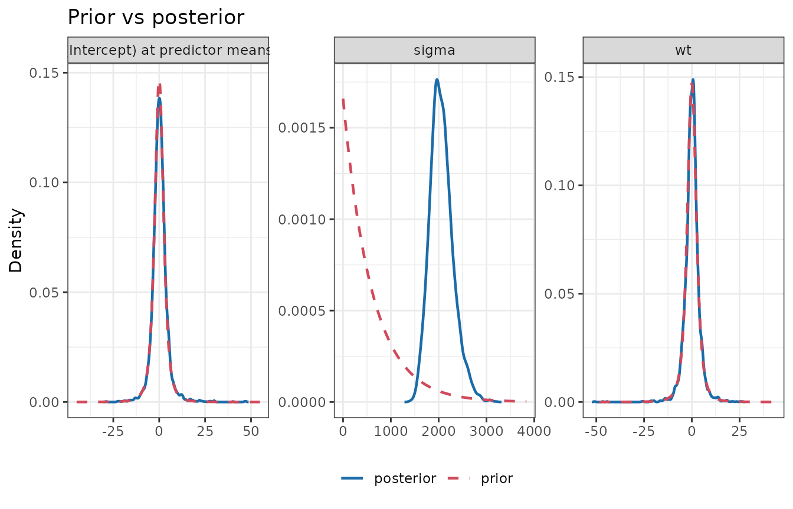
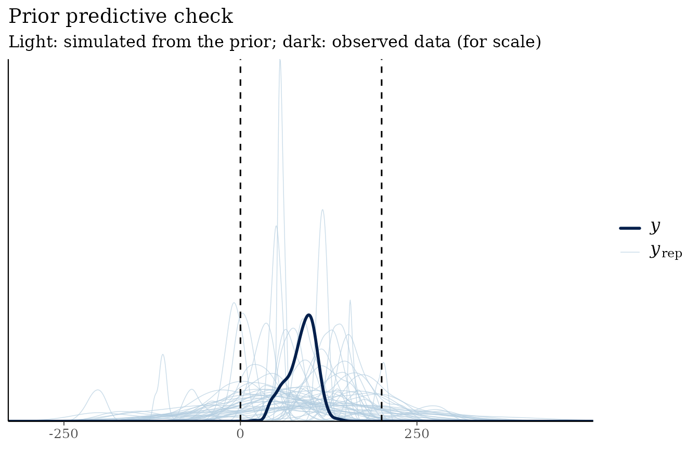
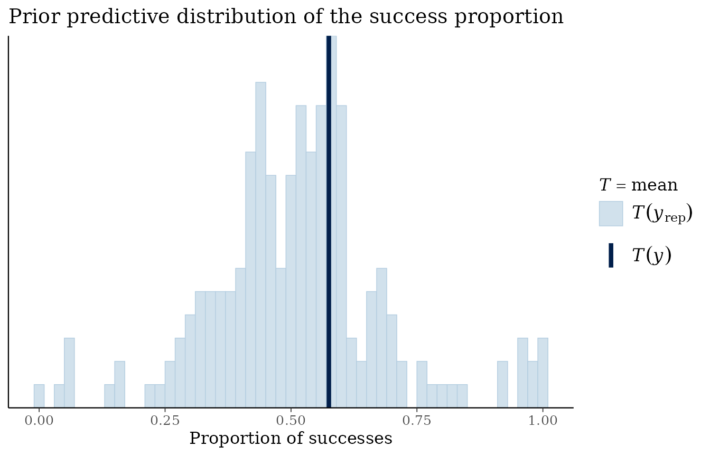

# Choosing priors: scale, autoscaling and prior predictive checks

``` r

library(bmbeR)
```

A prior is a statement about plausible parameter values, and a
regression coefficient’s plausible values depend entirely on the units
of the outcome and the predictors. This article shows what goes wrong
when that is ignored, the options for getting it right, and how prior
predictive checks catch problems before any model is fitted.

## Why scale matters

`mtcars` records fuel efficiency (`mpg`) and weight (`wt`, in 1000 lbs).
We fit the same model twice: once with `mpg`, and once with the outcome
expressed in hundredths of a mile per gallon (`mpg * 100`). Nothing
about the data has changed except the units, so the second slope should
be exactly 100 times the first.

First with a *fixed-scale* prior, `student_t(3, 0, 2.5)` on every
coefficient, which was the default in bmbeR 1.x:

``` r

d <- mtcars
d$mpg100 <- d$mpg * 100
fixed <- prior_config(intercept = prior_spec("student_t", 0, 2.5, df = 3),
                      slope     = prior_spec("student_t", 0, 2.5, df = 3))

fit_mpg    <- fit_model_with_prior(d, mpg ~ wt, prior_config = fixed,
                                   refresh = 0, on_nonconvergence = "ignore")
fit_mpg100 <- fit_model_with_prior(d, mpg100 ~ wt, prior_config = fixed,
                                   refresh = 0, on_nonconvergence = "ignore")
rbind(
  "OLS, mpg"            = coef(lm(mpg ~ wt, d)),
  "fixed prior, mpg"    = coef(fit_mpg),
  "OLS, mpg*100"        = coef(lm(mpg100 ~ wt, d)),
  "fixed prior, mpg*100" = coef(fit_mpg100)
)
#>                        (Intercept)           wt
#> OLS, mpg               37.28512617   -5.3444716
#> fixed prior, mpg       36.74066218   -5.1962046
#> OLS, mpg*100         3728.51261673 -534.4471573
#> fixed prior, mpg*100   -0.07467113    0.1569807
```

On the original scale the prior is harmless. On the rescaled outcome the
same prior says “the slope is almost certainly within a few units of
zero”, while the data say it is around −530. The prior wins: the model
attributes everything to noise (look at `sigma`).

``` r

plot_prior_posterior(fit_mpg100)
```



The MCMC diagnostics do not flag this, because the chains mix perfectly
well around the wrong answer:

``` r

attr(fit_mpg100, "bmb_convergence")$converged
#> [1] TRUE
```

Two checks do catch it. **Before fitting**, a prior predictive check
shows that these priors expect outcomes centred on zero, far from any
plausible value of `mpg * 100`:

``` r

prior_predictive_check(d, mpg100 ~ wt, prior_config = fixed,
                       plausible_range = c(500, 5000), refresh = 0)
#> <bmb_prior_check> 200 simulated data sets of 32 observations (gaussian family)
#>   Observed outcome range     : [1040, 3390]
#>   Prior predictive quantiles : 1%: -2320 | 5%: -1175 | 50%: 2.063 | 95%: 1241 | 99%: 2446
#>   Mean of simulated data (5%, 50%, 95%): -148.7, -0.6828, 182.7
#>   Share of simulated values outside plausible range [500, 5000]: 85.0%
#>   ! More than 5% of prior predictive values are implausible: consider tighter
#>     or better-located priors.
```

**After fitting**,
[`prior_sensitivity()`](https://elkronos.github.io/bmbeR/reference/prior_sensitivity.md)
shows that the posterior is dominated by the prior. The posterior has
found a self-consistent but wrong explanation: with a huge residual SD
the data carry almost no information about the slope, so the local
diagnosis is “weak likelihood”, and the slope’s posterior contraction is
close to zero despite 32 observations with a strong relationship.

``` r

s <- prior_sensitivity(fit_mpg100)$summary
s[, c("variable", "mean", "contraction", "diagnosis")]
#>                variable         mean contraction         diagnosis
#> (Intercept) (Intercept) 2.517843e-01 -0.01856442   weak likelihood
#> wt                   wt 6.088883e-02  0.12572857   weak likelihood
#> sigma             sigma 2.061119e+03  0.83814473 informative prior
```

Power-scaling diagnostics are *local*: they describe the posterior you
obtained, not the one you should have obtained. That is why the prior
predictive check, which is a global check, comes first.

## Four ways to get the scale right

1.  **Standardise** outcome and predictors, then use unit-scale priors
    such as `normal(0, 1)`. Simple and transparent, but coefficients
    must be back-transformed for interpretation.
2.  **Autoscale.** `prior_spec(..., autoscale = TRUE)` lets rstanarm
    rescale the prior by the standard deviations of the outcome and
    predictors (Gelman et al., 2008). Components you leave `NULL` in
    [`prior_config()`](https://elkronos.github.io/bmbeR/reference/prior_config.md)
    use rstanarm’s autoscaled defaults.
3.  **Use substantive knowledge** in the natural units, as in the *Get
    started* vignette.
4.  **Derive priors from data** defensibly with
    [`empirical_bayes_priors()`](https://elkronos.github.io/bmbeR/reference/empirical_bayes_priors.md)
    (see the *Data-informed priors* article).

With the (autoscaled) defaults, the two fits agree up to the change of
units:

``` r

fit_default <- fit_model_with_prior(d, mpg100 ~ wt, refresh = 0)
coef(fit_default)["wt"] / coef(fit_mpg)["wt"]
#>       wt 
#> 102.2612
```

[`rstanarm::prior_summary()`](https://mc-stan.org/rstantools/reference/prior_summary.html)
shows what autoscaling did:

``` r

rstanarm::prior_summary(fit_default)
#> Priors for model 'fit_default' 
#> ------
#> Intercept (after predictors centered)
#>   Specified prior:
#>     ~ normal(location = 2009, scale = 2.5)
#>   Adjusted prior:
#>     ~ normal(location = 2009, scale = 1507)
#> 
#> Coefficients
#>   Specified prior:
#>     ~ normal(location = 0, scale = 2.5)
#>   Adjusted prior:
#>     ~ normal(location = 0, scale = 1540)
#> 
#> Auxiliary (sigma)
#>   Specified prior:
#>     ~ exponential(rate = 1)
#>   Adjusted prior:
#>     ~ exponential(rate = 0.0017)
#> ------
#> See help('prior_summary.stanreg') for more details
```

## Prior predictive checks

A prior predictive check simulates outcomes from the priors alone (the
likelihood is switched off) and asks whether they look like data that
could plausibly have been observed (Gabry et al., 2019). It is the most
direct way to see what a set of priors *means*.

### A continuous outcome

``` r

data(kidiq, package = "rstanarm")
pc_default <- prior_predictive_check(kidiq, kid_score ~ mom_iq + mom_hs,
                                     plausible_range = c(0, 200), refresh = 0)
pc_default
#> <bmb_prior_check> 200 simulated data sets of 434 observations (gaussian family)
#>   Observed outcome range     : [20, 144]
#>   Prior predictive quantiles : 1%: -164.7 | 5%: -74.91 | 50%: 85.42 | 95%: 245.4 | 99%: 341
#>   Mean of simulated data (5%, 50%, 95%): 11.48, 84.37, 166.5
#>   Share of simulated values outside plausible range [0, 200]: 26.8%
#>   ! More than 5% of prior predictive values are implausible: consider tighter
#>     or better-located priors.
```

rstanarm’s defaults are deliberately weak: a noticeable share of
simulated test scores are negative or above 200. That is often
acceptable (weak priors let the data speak), but the check makes the
trade-off visible. Priors based on what test scores can look like (see
the *Get started* vignette) keep the simulations in a sensible range.

``` r

plot(pc_default)
```



### Logistic regression: “non-informative” priors are informative

For binary outcomes, wide priors on the logit scale are a classic trap.
The `wells` data (Gelman & Hill, 2007) record whether households in
Bangladesh switched away from an unsafe well. Consider three sets of
priors for a model with three predictors:

``` r

data(wells, package = "rstanarm")
wells$dist100 <- wells$dist / 100
f <- switch ~ dist100 + arsenic + educ

wide <- prior_config(intercept = prior_spec("normal", 0, 10),
                     slope     = prior_spec("normal", 0, 10))
narrow <- prior_config(slope = prior_spec("normal", 0, 0.5, autoscale = TRUE))

checks <- list(
  "normal(0, 10)"              = prior_predictive_check(wells, f, binomial(), wide, refresh = 0),
  "rstanarm default"           = prior_predictive_check(wells, f, binomial(), NULL, refresh = 0),
  "normal(0, 0.5), autoscaled" = prior_predictive_check(wells, f, binomial(), narrow, refresh = 0)
)
sapply(checks, function(x) x$summary$share_extreme)
#>              normal(0, 10)           rstanarm default 
#>                  0.9058278                  0.5127947 
#> normal(0, 0.5), autoscaled 
#>                  0.2277599
```

The numbers are the share of prior predictive success probabilities
below 5% or above 95%. The “vague” `normal(0, 10)` prior claims that
almost every household’s decision is a foregone conclusion. Even the
weakly informative default does this for a large share of households,
because the variances of independent coefficient priors add up on the
logit scale as predictors accumulate (Gelman et al., 2020). Tighter,
autoscaled priors spread the probabilities more evenly, which matches
what we actually believe before seeing the data.

``` r

plot(checks[["normal(0, 10)"]])
#> Note: in most cases the default test statistic 'mean' is too weak to detect
#> anything of interest.
```



## Checklist

- Write priors in the units of your data, or standardise, or autoscale.
- Run
  [`prior_predictive_check()`](https://elkronos.github.io/bmbeR/reference/prior_predictive_check.md)
  with a `plausible_range` you can defend.
- After fitting, run
  [`prior_sensitivity()`](https://elkronos.github.io/bmbeR/reference/prior_sensitivity.md):
  a `prior-data conflict` or a small `contraction` tells you the prior
  is doing more work than you may have intended.

## References

Gabry, J., Simpson, D., Vehtari, A., Betancourt, M., & Gelman, A.
(2019). Visualization in Bayesian workflow. *JRSS A*, 182(2), 389–402.

Gelman, A., & Hill, J. (2007). *Data Analysis Using Regression and
Multilevel/Hierarchical Models*. Cambridge University Press.

Gelman, A., Jakulin, A., Pittau, M. G., & Su, Y.-S. (2008). A weakly
informative default prior distribution for logistic and other regression
models. *The Annals of Applied Statistics*, 2(4), 1360–1383.

Gelman, A., Vehtari, A., Simpson, D., et al. (2020). Bayesian workflow.
*arXiv:2011.01808*.
